# captcha

##### 一个 PHP 验证码库


### 安装

```shell
$ composer require yokov/captcha -vvv
```

### 使用

```php
$config = [
    // 验证码字符类型
    'charType'          => 'default',
    // 验证码长度
    'length'            => 4,
    // 是否是 gif 动态图
    'isGif'             => false,
    // 动图帧率
    'gifFps'            => 12,
    // 图片宽度
    'width'             => 150,
    // 图片高度
    'height'            => 40,
    // 字体文件路径
    'fontPath'          => '',
    // 字体大小
    'fontSize'          => 24,
];

$builder = new \Yokov\Captcha\CaptchaBuilder($config);

// 获取验证码字符串
$builder->getChar();

// 生成验证码图片
$builder->build();
```

### 部分设置

* 验证码字符类型
  1. default: 大小写字母和数字混合
  2. only_char: 只有大小写字母
  3. only_number: 只有数字
  
* 字体文件
  * _注：可自定义字体文件，fontPath 配置相应的字体文件路径即可_

  * _库中内置 9 种字体(fontPath 设置 1-9 可分别指定相应的字体)_
  
  | 字体序号 | 静态样式 | 动图 |
  | :----: | :----: | :----: |
  | 1 | 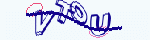 | 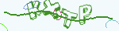 |
  | 2 | 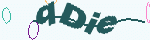 |  |
  | 3 | 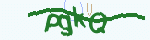 | 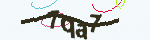 |
  | 4 |  | 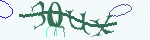 |
  | 5 | 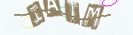 | 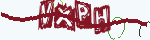 |
  | 6 |  | 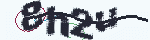 |
  | 7 | 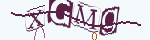 | 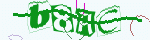 |
  | 8 | 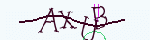 | 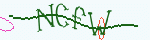 |
  | 9 |  |  |


### License

BSD
